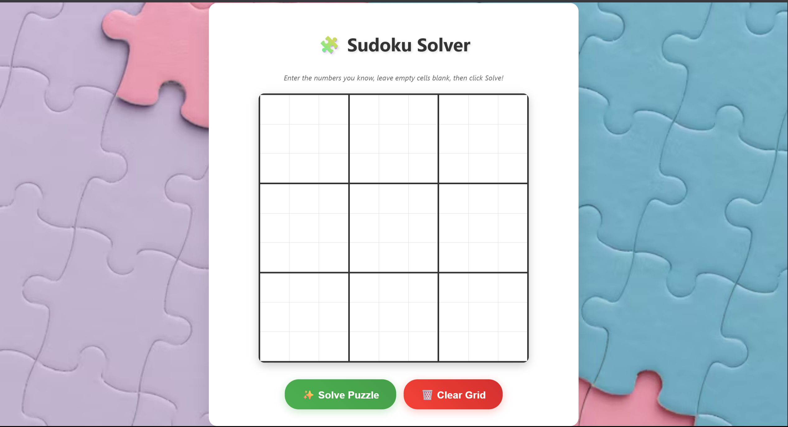
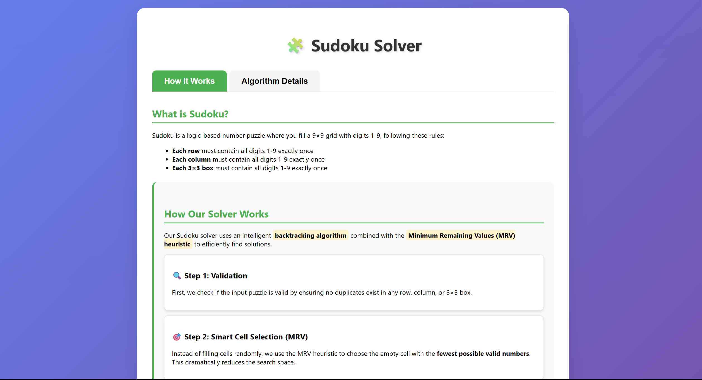

# 🧩 Sudoku Solver Web App (Django)

A web-based Sudoku puzzle solver built using Django and Python. Users can input custom Sudoku puzzles and get the answer.

---

## 🚀 Features

- ✍️ Input your own Sudoku puzzle via a web form
- 🧠 Uses backtracking algorithm with Minimum Remaining Values (MRV) heuristic
- 🖥️ Web interface using Django templating
- 🧪 Testable, clean structure for extending or modifying the solving logic

---

## 🛠️ Tech Stack

- **Python 3**
- **Django 4.x**
- **HTML/CSS**
- **MRV + Backtracking Algorithm**

---

## 📂 Project Structure

```
sudoku/
├── solver/                # Django project config
│   ├── settings.py
│   ├── urls.py
├── sudoku/                # Django app
│   ├── templates/         # HTML templates
│   │   ├── sudoku_form.html
│   │   └── sudoku_explanation.html
│   ├── static/images/     # Static assets
│   ├── views.py           # Main solving logic
│   ├── models.py          # (Not heavily used)
│   ├── urls.py
├── db.sqlite3             # Default database
├── manage.py
├── requirements.txt
└── .env                   # Contains secret keys (not committed)
```

---

## ⚙️ Setup Instructions

1. **Clone the repository**

```bash
git clone https://github.com/yourusername/sudoku-solver-django.git
cd sudoku-solver-django
```

2. **Set up a virtual environment**

```bash
python -m venv venv
source venv/bin/activate  # On Windows: venv\Scripts\activate
```

3. **Install dependencies**

```bash
pip install -r requirements.txt
```

4. **Create a `.env` file**

```env
SECRET_KEY='your-secret-key'
DEBUG=True
ALLOWED_HOSTS=127.0.0.1,localhost
```

5. **Run migrations and start the server**

```bash
python manage.py migrate
python manage.py runserver
```

6. **Visit in your browser**

```
http://127.0.0.1:8000/
```

---

## 🧠 How It Works

- Uses recursive **backtracking** and **MRV heuristic** to solve Sudoku puzzles.
- Form data is captured via `POST` and passed to the solving function.
- Output can be displayed step-by-step or as the final solved board.

---

### 🎯 Main Sudoku Interface



### 🧠 Explaination page



---

## 🙌 Contributing

Pull requests are welcome! If you'd like to improve the solver, UI, or performance — feel free to fork and contribute.

---

## 📜 License

This project is open-source under the [MIT License](LICENSE).

---

## 💡 Future Improvements

- Add animated solving steps
- Difficulty-level classification
- Upload image of Sudoku puzzle (OCR-based input)
